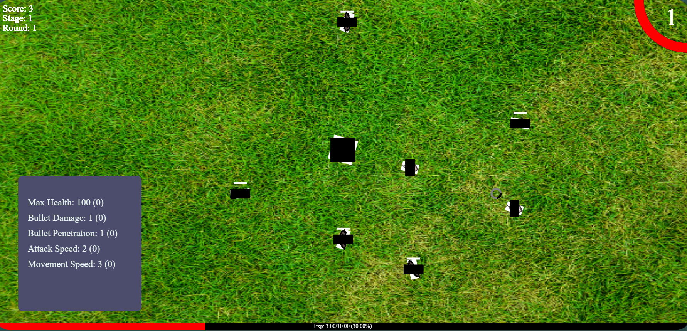

# Personal GITHUB pages Website

## Game Changes
- Cobweb -> Spawns a cobweb for 2s when enemy is not killed instantly and slows down enemies that are within the cobweb by 5.
- Game background
- Toggle Shoot
  - Added Keybind: T
  - Enables after 3s from 5s
- Added Health Bar for enemies
- Added amount of alloted points in player stats.
- Added Stages in top left below rounds
  - Stage 1: Rounds 1-5
  - Stage 2: Rounds 6-10
  - And so on...
- New Enemy -> COCKROACH!!! (see summary of stats below compared to worm) **STAGE 2**
  - Higher HP (2x)
  - Higher Damage (1.75x)
  - Higher Speed (1.5x)
- Start Menu improved looking better
- SFX
  - Background Music
  - Changed Level Up sound
- Portal to next stage after defeating the stage boss
- Added a notice if your screen resolution is not the 'recommended' resolution for the game.
- Player Dash (not a dash lol just a speed buff)
- Added FPS at the bottom right

## Bosses
- Stage 1 (Boss King)
- Stage 2 (Infested Cockroach)

## Changes
- Upgrades
  - Movement Speed: 0.2 -> 0.5
- Full Health Regen: Every round -> Every level
- Collision Detection for rotated rectangles now implemented. (https://www.youtube.com/watch?v=MvlhMEE9zuc)

## Hotfixes
- Shoots 2 times after starting a game and once on restart.

## Collision Detection (Old vs New)
- White: Hitbox (Rotated Image) of the new version
- Black: Hitbox (Non-rotated Image) of the old version

# Socials
[Discord Profile](https://discord.com/users/341604307113738243)

[Discord Server](https://discord.gg/6QmeEDjWUm)